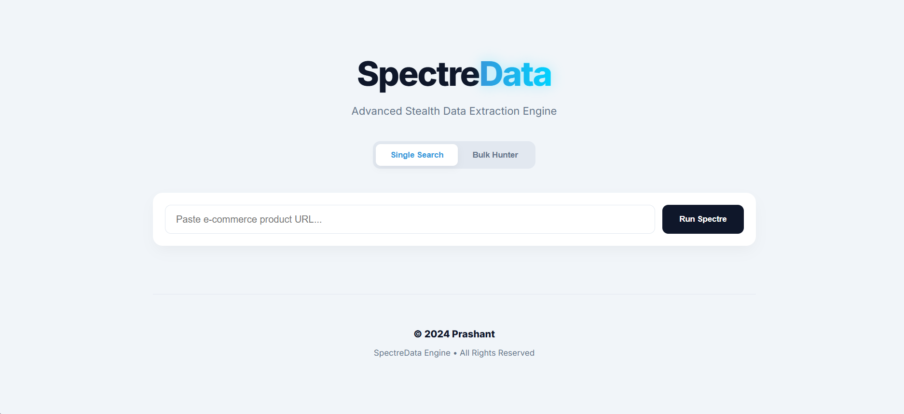
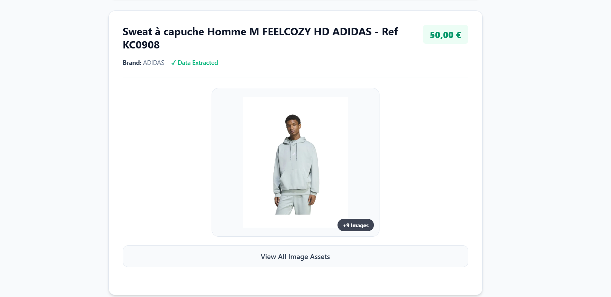
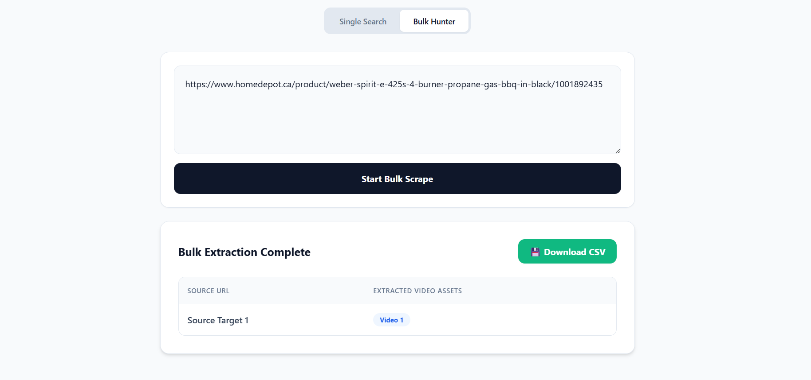

👻 SpectreData
SpectreData is a high-performance, full-stack web scraping engine designed to bypass modern anti-bot protections and extract rich product data, high-resolution imagery, and video assets from complex e-commerce platforms.

Built with a Spring Boot (Java) backend powered by Playwright and a React frontend, it features a unique "Ghost Mode" that allows for headless background scraping using persistent browser contexts.
## 🚀 Key Features
🧠 Intelligent Extraction Engine
JSON Data Fallback: When price data is hidden behind React/Next.js states and absent from HTML, SpectreData deep-scrapes <script> tags to extract raw price values via Regex.

Protocol-Relative URL Fixer: Automatically detects and repairs // links (common in CDNs) by appending https:, ensuring all extracted assets are functional.

Variant-Specific Targeting: Precise CSS selector logic isolates images for a selected product variant, ignoring irrelevant colors or sizes loaded in the background.

Multi-Source Video Hunter: Aggressively hunts for videos across <video> tags, iframes (YouTube/Vimeo), and og:video meta tags.

YouTube Link Transformer: Automatically converts YouTube embed links into standard watch URLs for better usability.

🛡️ Anti-Bot & Stealth (The "Spectre" Logic)
Ghost Mode (Headless): Runs a silent Chromium instance in the background for a seamless user experience.

Persistent Profile Storage: Saves Cloudflare clearance cookies to a local profile (playwright-profile), allowing the bot to "remember" its human verification and bypass security on subsequent runs.

Stealth Injections: Erases robotic fingerprints by overwriting navigator.webdriver and spoofing browser plugins, languages, and the chrome.runtime object.

💻 Modern Dashboard
Bulk Video Hunter: A dedicated high-speed mode to process lists of URLs in parallel tabs.

Collapsible Data Drawers: Sleek UI that hides raw URLs behind interactive buttons to keep the interface clean and professional.

Live Extraction Status: Visual loading spinners and "Robot Deploying" states to improve User Experience.

Data Export: One-click Download to CSV functionality for bulk processing in Excel.

## 🏗️ Technical Architecture

SpectreData utilizes a persistent browser context to defeat Cloudflare. Unlike standard scrapers that launch a "clean" browser every time, SpectreData maintains a local session.

The Workflow:

Manual Handshake: On the first run, the user solves the Cloudflare puzzle in non-headless mode.

Cookie Capture: Playwright saves the clearance cookie to the playwright-profile directory.

Ghost Execution: On all future runs, the backend loads these cookies, tricking the server into believing the automated request is part of a verified human session.

## 🛠️ Tech Stack

Frontend: React.js, CSS3 (Custom Animations & Spectre Glow)

Backend: Java 17, Spring Boot, Maven

Automation: Playwright for Java

Security Bypass: Persistent Contexts & Script Injection

## 🛠️ Installation & Setup
```
1. Backend (Java)
Ensure you have Java 17+ and Maven installed.

Navigate to the backend folder.

Run mvn install to download dependencies.

Initial Setup: For the very first run, set .setHeadless(false) in ScraperService.java to manually solve any initial anti-bot puzzles.

Run the application via your IDE or mvn spring-boot:run.

2. Frontend (React)
Navigate to the frontend folder.

Run npm install.

Run npm start.

The dashboard will be available at http://localhost:3000.
```
## 🔮 Future Roadmap
[ ] Proxy Rotation: Integration with residential proxies to avoid IP rate-limiting.

[ ] Database Persistence: Connect PostgreSQL to track price history over time.

[ ] Scheduled Scrapes: Cron-job functionality to auto-scrape specific products every 24 hours.

[ ] Advanced AI Parsing: Using LLMs to identify product selectors on unknown e-commerce layouts.

## 📸 Interface Showcase

Here is a look at the SpectreData dashboard, built with React and Tailwind CSS.

### Home


## Single Search


### High-Speed Bulk Multi-Threaded Hunter

